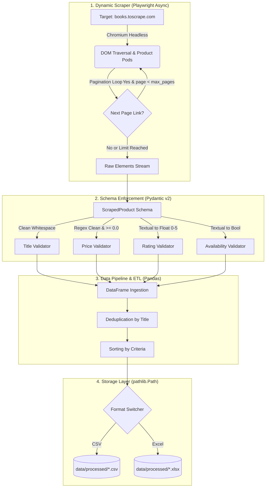

# Dynamic Web Harvester 🚀

[](https://www.python.org/)
[](https://playwright.dev/python/)
[](https://docs.pydantic.dev/)
[](https://pandas.pydata.org/)
[](https://pytest.org/)
[](https://peps.python.org/pep-0484/)
[](https://www.docker.com/)
[](LICENSE)

A dynamic, asynchronous web data extraction and processing pipeline engineered for production environments. Built with Python featuring browser automation via **Playwright**, data contract validation with **Pydantic v2**, and a lightweight ETL engine powered by **Pandas** for deduplication, sorting, and multi-format export (CSV / Excel). Fully containerized with **Docker** and **Docker Compose** for zero-configuration client delivery.

---

## 🗄️ System Architecture



---

## 🌟 Engineering Highlights

- **Asynchronous Crawler with Playwright:** Headless Chromium automation with realistic User-Agent headers, standard viewports, and explicit 10-second operation timeouts.
- **Intelligent Pagination:** Automatically discovers and traverses pagination links (`li.next a`) until all catalog pages are exhausted or the `--max-pages` threshold is reached.
- **Strict Data Contracts with Pydantic v2:**
  - Automatic whitespace trimming across all textual fields and URLs.
  - Robust currency parsing (e.g., `"£51.77"` ➔ `51.77`) with numeric validation enforcing `price >= 0.0`.
  - Semantic star rating conversion (`"One"` through `"Five"` ➔ `1.0` through `5.0`).
  - Parsing inventory availability strings into native boolean flags.
- **Deduplication & Cleaning via Pandas:** Removes duplicate items by title while preserving the initial occurrence and provides configurable column-based sorting.
- **Containerized & Production Ready:** Includes pre-configured `Dockerfile` with official Playwright runtime and `docker-compose.yml` for single-command client execution with host volume mapping.
- **Graceful Fault Tolerance:** Element-level exception boundaries ensure missing attributes or corrupted DOM nodes are logged without aborting batch execution.
- **Structured Standard Logging:** Replaces all arbitrary `print()` statements with Python's standard `logging` module, including timestamps, log levels (`INFO`, `DEBUG`, `WARNING`, `ERROR`), and structured messages.
- **Strict Type Hinting:** Full PEP 484 type annotations on all function and method signatures for superior maintainability and static analysis support.

---

## 📁 Project Structure

```text
dynamic-web-harvester/
├── data/
│   └── processed/            # Export destination for CSV and Excel files (git-ignored)
├── src/
│   ├── __init__.py           # Package initializer
│   ├── models.py             # Pydantic v2 schemas and validators
│   ├── pipeline.py           # Cleaning, deduplication, and export pipeline
│   └── scraper.py            # Asynchronous scraper using Playwright Chromium
├── tests/
│   ├── __init__.py
│   ├── test_models.py        # Unit tests for schemas and data integrity
│   ├── test_pipeline.py      # Unit tests for transformations and file exports
│   └── test_scraper.py       # Unit tests for scraper logic without network calls
├── .dockerignore             # Context filter for efficient image builds
├── .gitignore                # Exclusion rules for data, logs, and caches
├── docker-compose.yml        # Zero-config execution and volume orchestration
├── Dockerfile                # Multi-stage/headless Playwright container image
├── main.py                   # CLI entrypoint with argparse and pipeline orchestration
├── README.md                 # Technical project documentation
└── requirements.txt          # Production and testing dependencies
```

---

## 🐳 Docker Deployment & Quickstart (Recommended)

The harvester is fully containerized using Microsoft's official Playwright image (`python:v1.49.0-jammy`) with all Chromium OS dependencies pre-installed.

### Option A: Via Docker Compose (Zero-Configuration Client Execution)

Run the full pipeline with a single command without rebuilding or managing dependencies:

```bash
docker compose up --build
```

* Processed datasets (`.csv` or `.xlsx`) are automatically written to your local `data/processed/` folder via volume mapping.
* Parameters (e.g. `--max-pages 10`) can be modified directly under the `command` key in `docker-compose.yml`.

### Option B: Via Docker CLI

```bash
# 1. Build the image
docker build -t dynamic-web-harvester .

# 2. Run extraction with customized arguments
docker run --rm -v $(pwd)/data/processed:/app/data/processed dynamic-web-harvester --max-pages 3 --format excel
```

> [!TIP]
> **Linux / macOS Volume Permissions:**  
> In Linux and macOS environments, files written to mounted volumes by default can be owned by `root`. To ensure output files match your local user permissions without needing `sudo` to modify or delete them, pass the `--user` flag:
> ```bash
> docker run --rm --user $(id -u):$(id -g) -v $(pwd)/data/processed:/app/data/processed dynamic-web-harvester
> ```

### Run Automated Tests Inside Docker

Verify pipeline integrity and schema validation in an isolated container environment:

```bash
docker run --rm --entrypoint pytest dynamic-web-harvester tests/ -v
```

---

## 🚀 Local Installation (Without Docker)

### 1. Clone the Repository and Navigate to Root

```bash
git clone https://github.com/Christianlamas062/dynamic-web-harvester.git
cd dynamic-web-harvester
```

### 2. Configure Virtual Environment

```bash
# Windows
python -m venv venv
.\venv\Scripts\activate

# Linux / macOS
python3 -m venv venv
source venv/bin/activate
```

### 3. Install Dependencies and Browser Binaries

```bash
pip install -r requirements.txt
playwright install chromium
```

---

## 💻 CLI Usage Guide

The harvester provides an intuitive command-line interface powered by `argparse`:

```text
usage: dynamic-web-harvester [-h] [--max-pages MAX_PAGES] [--format {csv,excel}]
                             [--output-dir OUTPUT_DIR] [--log-level {DEBUG,INFO,WARNING,ERROR}]

Production-grade asynchronous web scraping pipeline using Playwright and Pandas.

options:
  -h, --help            show this help message and exit
  --max-pages MAX_PAGES
                        Maximum number of pages to scrape (default: 2)
  --format {csv,excel}  Target export format: 'csv' or 'excel' (default: 'csv')
  --output-dir OUTPUT_DIR
                        Destination directory for processed output files (default: 'data/processed')
  --log-level {DEBUG,INFO,WARNING,ERROR}
                        Logging verbosity level (default: 'INFO')
```

### Execution Examples

#### 1. Rapid Single-Page Extraction (CSV):
```bash
python main.py --max-pages 1 --format csv
```

#### 2. Multi-Page Extraction (5 Pages to Excel):
```bash
python main.py --max-pages 5 --format excel
```

#### 3. Diagnostic Mode with Verbose Logging:
```bash
python main.py --max-pages 2 --format csv --log-level DEBUG
```

---

## 🧪 Automated Testing

The project includes an exhaustive unit testing suite implemented with `pytest` and `pytest-asyncio`. Tests execute **100% offline** using isolated fixtures and Playwright mock objects:

```bash
pytest -v
```

### Test Coverage Overview:
- **`tests/test_models.py`**:
  - Schema instantiation and automatic whitespace stripping.
  - Currency extraction and string-to-float conversions.
  - Price non-negativity constraint validation (`price >= 0.0`).
  - Validation error handling for non-numeric and corrupted price values.
  - Mandatory non-empty title enforcement.
  - Textual star rating mapping (`"One"` through `"Five"`) and boundary checks (`0.0` to `5.0`).
  - String inventory availability parsing to booleans.
- **`tests/test_pipeline.py`**:
  - Duplicate record suppression by product title.
  - Ascending and descending price ordering.
  - Safe handling of empty datasets.
  - Multi-format file export verification (CSV and Excel) via `tmp_path`.
  - Rejection of unsupported export format strings.
- **`tests/test_scraper.py`**:
  - Asynchronous product card parsing using mocked Playwright locators.
  - Resilient behavior and non-crashing fallback handling when encountering missing DOM elements.

---

## 📄 License

Distributed under the MIT License. See `LICENSE` for details.
