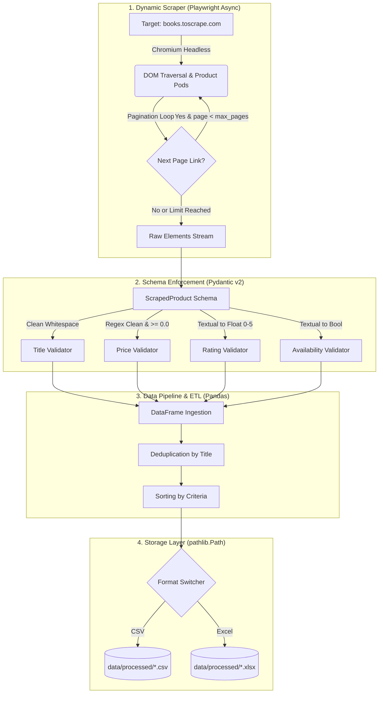

# Dynamic Web Harvester 🚀

[](https://www.python.org/)
[](https://playwright.dev/python/)
[](https://docs.pydantic.dev/)
[](https://pandas.pydata.org/)
[](https://pytest.org/)
[](https://peps.python.org/pep-0484/)
[](LICENSE)

Un pipeline dinámico y asíncrono de extracción y procesamiento de datos web para entornos productivos. Implementado en Python con automatización de navegador mediante **Playwright**, validación de contratos de datos con **Pydantic v2**, y un motor ETL ligero con **Pandas** para deduplicación, ordenamiento y exportación multidestino (CSV / Excel).

---

## 🏛 Arquitectura del Sistema



---

## 🌟 Características de Ingeniería

- **Crawler Asíncrono con Playwright:** Control headless de Chromium con User-Agent verosímil, configuración de viewports y timeouts explícitos de 10s por operación.
- **Paginación Inteligente:** Detección y navegación automática a través de los selectores de paginación del catálogo web hasta agotar las páginas disponibles o alcanzar el límite `max_pages`.
- **Validación Estricta con Pydantic v2:**
  - Limpieza automática de espacios en blanco en campos textuales y URLs.
  - Conversión de precios con símbolos monetarios (`£51.77` ➔ `51.77`) asegurando invariantes numéricas (`price >= 0.0`).
  - Mapeo de ratings semánticos (`One` a `Five` ➔ `1.0` a `5.0`).
  - Parsing de disponibilidad de inventario a booleanos nativos.
- **Deduplicación & Limpieza con Pandas:** Eliminación de duplicados basada en títulos normalizados y ordenamiento configurable de productos.
- **Manejo Resiliente de Fallos:** Captura granular de excepciones por elemento; la ausencia o corrupción de un campo individual no interrumpe la recolección del resto del lote.
- **Logging Estructurado:** Sustitución total de `print()` por el módulo estándar `logging` con niveles de severidad (`INFO`, `DEBUG`, `WARNING`, `ERROR`) y timestamps.
- **Type Hinting Exhaustivo:** Tipado estático PEP 484 en todas las firmas de funciones y métodos.

---

## 📁 Estructura del Proyecto

```text
dynamic-web-harvester/
├── data/
│   └── processed/            # Salida de archivos CSV y Excel (ignorado en git)
├── src/
│   ├── __init__.py           # Inicializador del paquete
│   ├── models.py             # Esquemas y validadores Pydantic v2
│   ├── pipeline.py           # Pipeline de limpieza, deduplicación y exportación
│   └── scraper.py            # Scraper asíncrono con Playwright Chromium
├── tests/
│   ├── __init__.py
│   ├── test_models.py        # Pruebas unitarias de esquemas y validadores
│   ├── test_pipeline.py      # Pruebas unitarias de transformaciones y exports
│   └── test_scraper.py       # Pruebas unitarias del scraper sin llamadas de red
├── .gitignore                # Reglas de exclusión para datos, logs y caches
├── main.py                   # CLI con argparse y orquestador del pipeline
├── README.md                 # Documentación técnica
└── requirements.txt          # Dependencias de producción y pruebas
```

---

## 🚀 Instalación y Puesta en Marcha

### 1. Clonar el repositorio y acceder

```bash
git clone https://github.com/usuario/dynamic-web-harvester.git
cd dynamic-web-harvester
```

### 2. Configurar el Entorno Virtual

```bash
# Windows
python -m venv venv
.\venv\Scripts\activate

# Linux / macOS
python3 -m venv venv
source venv/bin/activate
```

### 3. Instalar Dependencias y Binarios de Navegador

```bash
pip install -r requirements.txt
playwright install chromium
```

---

## 💻 Guía de Uso (CLI)

El pipeline cuenta con una interfaz de línea de comandos construida con `argparse`:

```text
usage: dynamic-web-harvester [-h] [--max-pages MAX_PAGES] [--format {csv,excel}]
                             [--output-dir OUTPUT_DIR] [--log-level {DEBUG,INFO,WARNING,ERROR}]

Production-grade asynchronous web scraping pipeline using Playwright and Pandas.

options:
  -h, --help            show this help message and exit
  --max-pages MAX_PAGES
                        Maximum number of pages to scrape (default: 2)
  --format {csv,excel}  Target export format: 'csv' or 'excel' (default: 'csv')
  --output-dir OUTPUT_DIR
                        Destination directory for processed output files (default: 'data/processed')
  --log-level {DEBUG,INFO,WARNING,ERROR}
                        Logging verbosity level (default: 'INFO')
```

### Ejemplos de Ejecución

#### 1. Extracción rápida (1 página) y exportación a CSV:
```bash
python main.py --max-pages 1 --format csv
```

#### 2. Extracción de 5 páginas con exportación a Excel:
```bash
python main.py --max-pages 5 --format excel
```

#### 3. Modo diagnóstico con logging detallado:
```bash
python main.py --max-pages 2 --format csv --log-level DEBUG
```

---

## 🧪 Pruebas Automatizadas

El proyecto incluye una suite exhaustiva de pruebas unitarias implementadas con `pytest` y `pytest-asyncio`. Las pruebas se ejecutan **100% desconectadas de la red** mediante fixtures y objetos simulados (mocks):

```bash
pytest -v
```

### Cobertura de Pruebas:
- **`tests/test_models.py`**:
  - Instanciación correcta y limpieza de espacios en blanco.
  - Conversión numérica de precios con símbolos de moneda.
  - Validación de precio no negativo (`price >= 0.0`).
  - Detección y rechazo de precios corruptos / no numéricos.
  - Validación de título obligatorio y no vacío.
  - Mapeo de ratings textuales (`One` a `Five`) y límites de rango (`0.0` a `5.0`).
  - Parsing de estados de inventario a booleanos.
- **`tests/test_pipeline.py`**:
  - Deduplicación por título conservando el registro inicial.
  - Ordenamiento ascendente y descendente por precio.
  - Manejo seguro de listas vacías.
  - Exportación y verificación de integridad en CSV y Excel con `tmp_path`.
  - Validación de formato de exportación no soportado.
- **`tests/test_scraper.py`**:
  - Extracción asíncrona de tarjetas de producto con locators de Playwright simulados.
  - Tolerancia y degradación elegante ante elementos faltantes en el DOM.

---

## 📄 Licencia

Distribuido bajo la Licencia MIT. Consulta `LICENSE` para más información.
